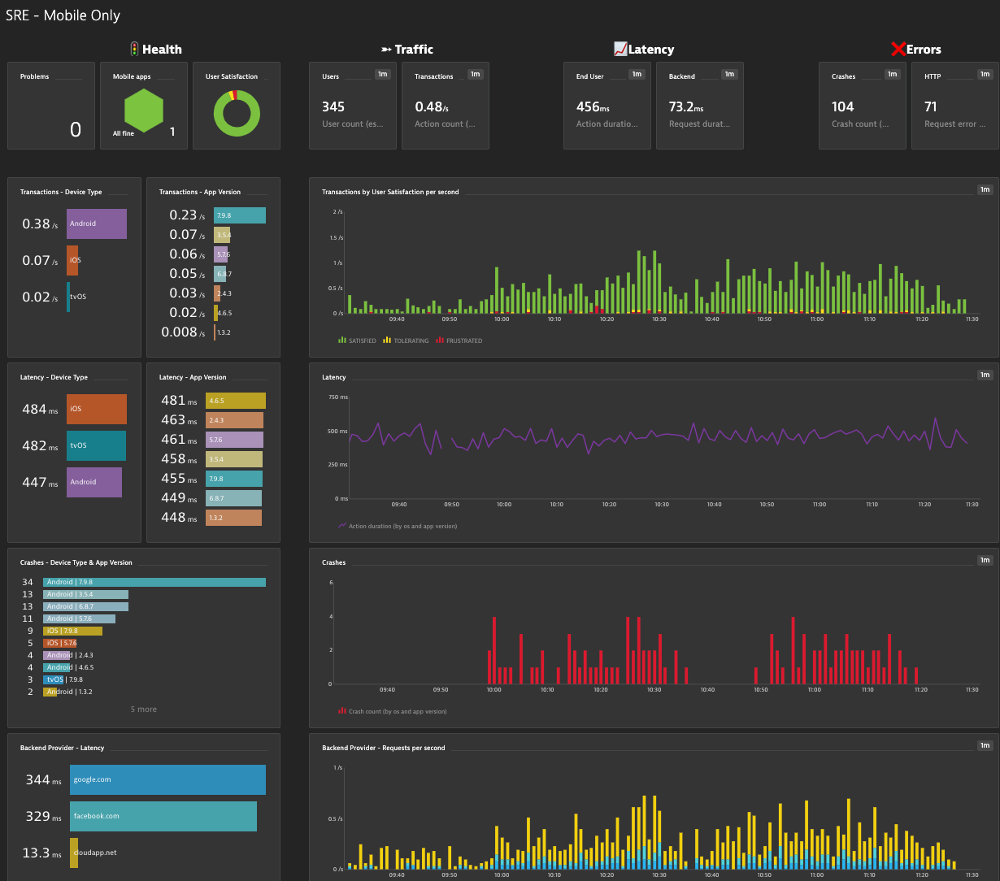

## SRE Dashboard for Mobile Application Only

This dashboard provides SRE Teams, Application Owners, etc... an end to end summary view into the current status of the Native Mobile Application.

Focus areas: 

- Health Status: Problems, Mobile Application
- Four golden signals of monitoring: Latency, Traffic, Errors, and Saturation
- Drilldown links for quick analysis (Mobile Application) is included

# Prerequisites Highlights

- Management zone created for target Mobile Application
- In the dashboard configurator pick the Managagment Zone and Mobile Application

# Notes

- Targeted for Mobile Appplication with no backend services or just want a Mobile only dashboard
- Latency metrics set to median
- Mobile, Service & Database requests metrics as shown as per second
