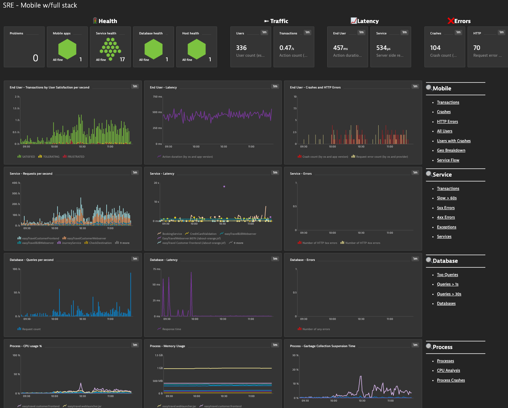

## SRE Dashboard for Mobile Application and Backend Services

This dashboard provides SRE Teams, Application Owners, etc... an end to end summary view into the current status of the Native Mobile User, backend services, databases and infrastructure.  

Focus areas: 

- Health Status: Problems, Mobile Application, Service, Database & Host 
- Four golden signals of monitoring: Latency, Traffic, Errors, and Saturation
- Drilldown links for quick analysis (Mobile Application, Service, Database, Process & Host) are included

# Prerequisites Highlights

- Management zone created for target Mobile Application & service backend which includes services,  databases,  processes & hosts.
- In the dashboard configurator pick the managagment zone and Mobile Applicaiton

# Notes

- Targeted for Mobile appplication and backend services observability
- Latency metrics set to median
- Mobile, Service & Database requests metrics as shown as per second
