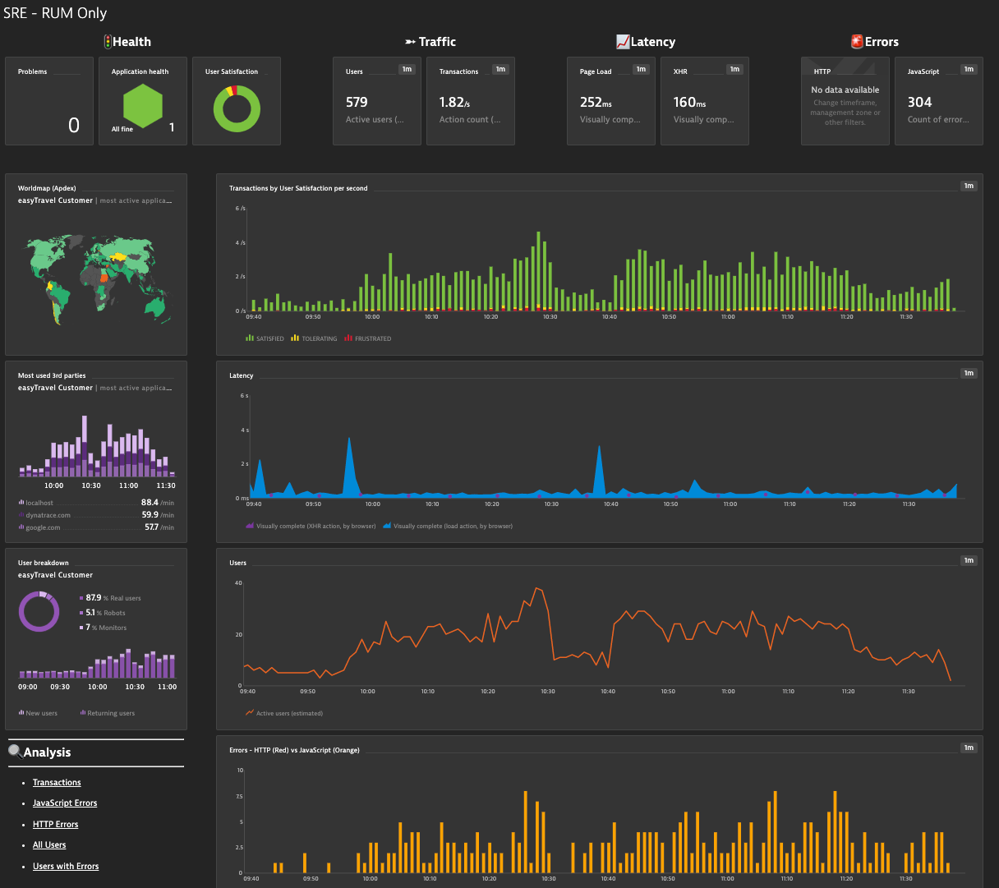

## SRE Dashboard for RUM Web Application Only

This dashboard provides SRE Teams, Application Owners, etc... an end to end summary view into the current status of a Web Application.  

Focus areas: 

- Health Status: Problems, Application
- Four golden signals of monitoring: Latency, Traffic, Errors, and Saturation
- Drilldown links for quick analysis (Application) are included

# Prerequisites Highlights

- Management Zone created for target RUM Application
- In the dashboard configurator pick the Managagment Zone and RUM Application

# Notes

- Targeted for RUM Web Appplication only or if you just want RUM Overview
- Latency metrics set to median
- End User shown as per second
