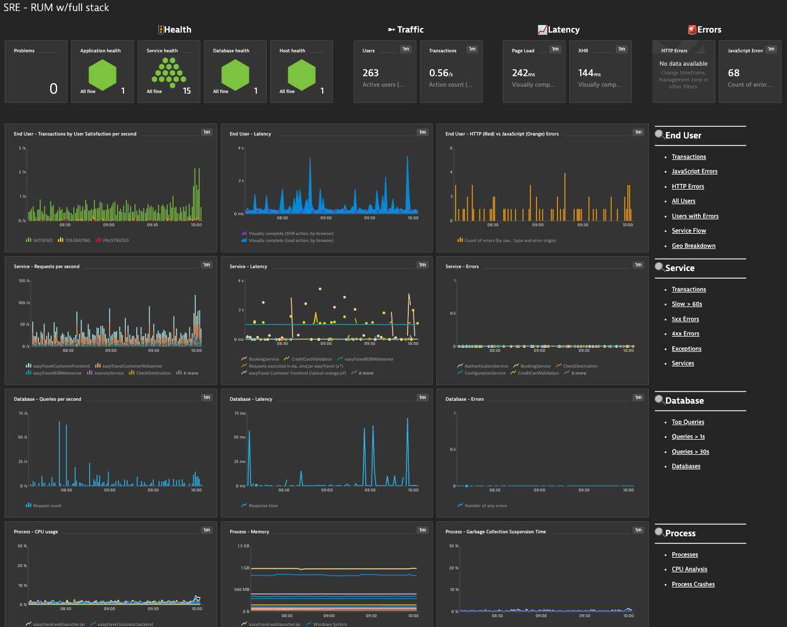

## SRE Dashboard for RUM (Web App) and Backend Services

This dashboard provides SRE Teams, Application Owners, etc... an end to end summary view into the current status of the Real User, backend services, databases and infrastructure.  

Focus areas: 

- Health Status: Problems, Application, Service, Database & Host 
- Four golden signals of monitoring: Latency, Traffic, Errors, and Saturation
- Drilldown links for quick analysis (Application, Service, Database, Process & Host) are included

# Prerequisites Highlights

- Management zone created for target RUM application & service backend which includes services,  databases,  processes & hosts.
- In the dashboard configurator pick the managagment zone and RUM Applicaiton

# Notes

- Targeted for RUM (web) appplication and backend services observability
- Latency metrics set to median
- End User, Service & Database requests metrics as shown as per second
