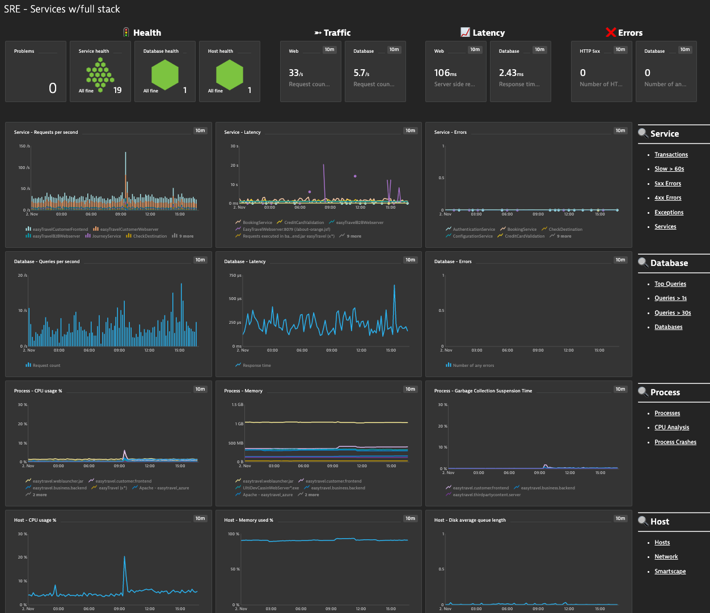

## SRE Dashboard for Full Stack Backend Services Only

This dashboard provides a Summary View for SRE Teams,  Application Owners, etc... to understand the current health on an applicaition. 

Focus areas: 

- Health Status: Problem, Service, Database & Host 
- Four golden signals of monitoring: Latency, Traffic, Errors, and Saturation
- Drilldown links to each area of interest (Service, Process & Host) are included

# Prerequisites Highlights

- Management zone created for target application backend which includes services,  databases,  processes & hosts.

# Notes

- Targeted for appplication backend services observability where no real user monitoring is being done
- Latency metrics are based off the median
- Service & Database requests metrics as shown as per second
